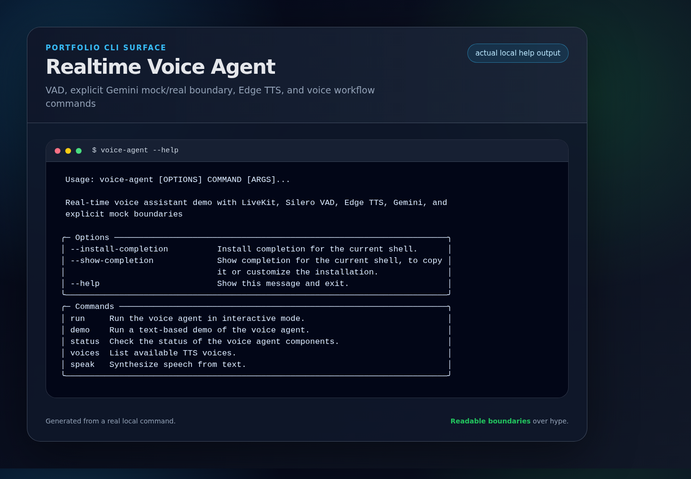
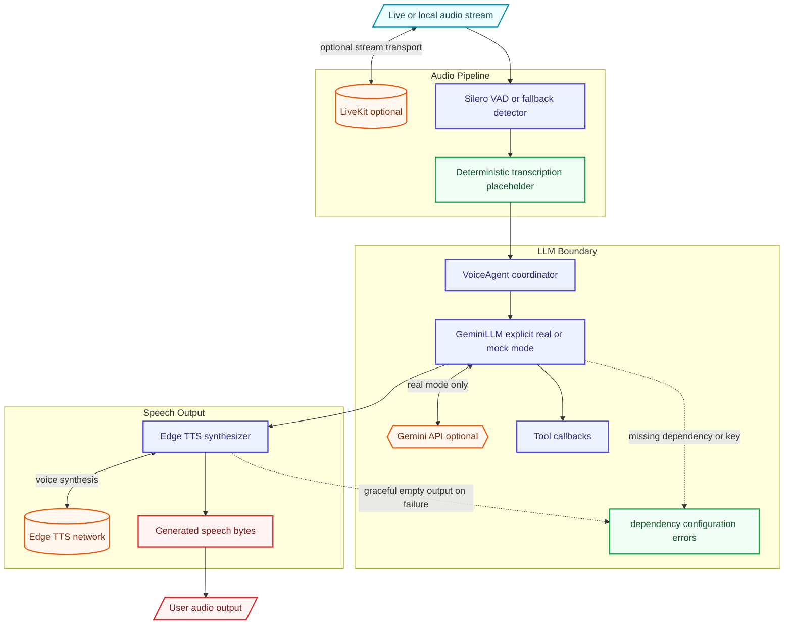

# Real-Time Voice Agent

A developer-focused real-time voice agent demo built with LiveKit, Silero VAD, Edge TTS, and Google Gemini for conversational AI experiments.

## Portfolio Showcase



- **Architecture deep dive:** [`docs/ARCHITECTURE.md`](docs/ARCHITECTURE.md)
- **Demo guide:** [`docs/DEMO.md`](docs/DEMO.md)
- **Reviewer focus:** LiveKit audio flow, VAD, explicit Gemini mock/real behavior, Edge TTS, and dependency failure handling.

## Architecture Overview



## Features

- **Real-time Voice Activity Detection**: Silero VAD for accurate speech detection with energy-based fallback
- **Low-latency Speech Synthesis**: Edge TTS for natural-sounding voice output
- **Conversational AI**: Google Gemini integration with explicit dependency/config failures
- **Tool Calling**: Register custom functions for the LLM to invoke
- **WebRTC Ready**: LiveKit integration scaffolding for real-time communication
- **Async Architecture**: Built with asyncio for high-performance concurrent processing
- **Interruption Handling**: Configurable user interruption support

## Installation

### Prerequisites

- Python 3.11+
- [uv](https://github.com/astral-sh/uv) (recommended) or pip
- Google Gemini API key

### Quick Start

```bash
# Clone the repository
git clone https://github.com/lord-dubious/realtime-voice-agent.git
cd realtime-voice-agent

# Create virtual environment and install dependencies
uv venv
source .venv/bin/activate
uv pip install -e ".[dev]"

# Set up environment variables
cp .env.example .env
# Edit .env with your API keys

# Run the demo
voice-agent demo
```

### Docker Setup

```bash
# Build and run with Docker Compose
docker-compose up -d

# Run the voice agent
docker-compose exec voice-agent voice-agent demo
```

## Usage

### CLI Commands

```bash
# Run the voice agent
voice-agent run

# Run demo mode (simulated conversation)
voice-agent demo

# Check agent status
voice-agent status

# List available TTS voices
voice-agent voices

# Speak a test message
voice-agent speak "Hello, world!"
```

### Python API

```python
import asyncio
import logging

from voice_agent import VoiceAgent, VoiceAgentConfig

logger = logging.getLogger(__name__)

async def main():
    # Create agent with custom config
    config = VoiceAgentConfig(
        model_name="gemini-2.5-flash",
        system_prompt="You are a helpful voice assistant.",
    )
    agent = VoiceAgent(config)
    
    # Register callbacks
    agent.on_transcription(lambda text: logger.info("User: %s", text))
    agent.on_response(lambda text: logger.info("Agent: %s", text))
    
    # Register custom tools
    def get_weather(city: str) -> str:
        return f"The weather in {city} is sunny, 22°C"
    
    agent.register_tool("get_weather", get_weather, "Get weather for a city")
    
    # Speak a greeting
    await agent.say("Hello! How can I help you today?")

asyncio.run(main())
```

For tests, demos, or offline examples that should not call Gemini, opt into deterministic mock responses explicitly:

```python
from voice_agent.llm import GeminiLLM

llm = GeminiLLM.create_mock()
response = await llm.generate("hello")
```

### Configuration

```python
from voice_agent import VoiceAgentConfig, VADConfig, TTSConfig

config = VoiceAgentConfig(
    # LLM settings
    model_name="gemini-2.5-flash",
    system_prompt="You are a helpful voice assistant.",
    max_conversation_turns=20,
    
    # VAD settings
    vad=VADConfig(
        threshold=0.5,
        min_speech_duration=0.25,
        min_silence_duration=0.5,
        sample_rate=16000,
    ),
    
    # TTS settings
    tts=TTSConfig(
        voice="en-US-AriaNeural",
        rate="+0%",
        volume="+0%",
        pitch="+0Hz",
    ),
    
    # Interruption handling
    interrupt_enabled=True,
)
```

## Environment Variables

| Variable | Description | Default |
|----------|-------------|---------|
| `GEMINI_API_KEY` | Google Gemini API key | Required |
| `LIVEKIT_URL` | LiveKit server URL | `ws://localhost:7880` |
| `LIVEKIT_API_KEY` | LiveKit API key | Optional |
| `LIVEKIT_API_SECRET` | LiveKit API secret | Optional |
| `TTS_VOICE` | Default TTS voice | `en-US-AriaNeural` |
| `VAD_THRESHOLD` | VAD detection threshold | `0.5` |

## Development

### Running Tests

```bash
# Run all tests
pytest

# Run with coverage
pytest --cov=voice_agent

# Run specific test file
pytest tests/test_agent.py -v
```

### Code Quality

```bash
# Lint code
ruff check src tests

# Format code
ruff format src tests
```

### Project Structure

```
realtime-voice-agent/
├── src/voice_agent/
│   ├── __init__.py      # Package exports
│   ├── models.py        # Pydantic data models
│   ├── vad.py           # Voice Activity Detection
│   ├── tts.py           # Text-to-Speech
│   ├── llm.py           # Gemini LLM integration
│   ├── agent.py         # Main VoiceAgent orchestrator
│   └── cli.py           # Typer CLI
├── tests/
│   ├── conftest.py      # Test fixtures
│   ├── test_models.py   # Model tests
│   ├── test_vad.py      # VAD tests
│   ├── test_tts.py      # TTS tests
│   ├── test_llm.py      # LLM tests
│   └── test_agent.py    # Agent orchestration tests
├── pyproject.toml
├── Dockerfile
├── docker-compose.yml
└── README.md
```

## Components

### Voice Activity Detection (VAD)

Uses Silero VAD for accurate speech detection with an energy-based fallback:

```python
from voice_agent.vad import VoiceActivityDetector, VADConfig

vad = VoiceActivityDetector(VADConfig(threshold=0.5))

# Detect speech in audio
has_speech = vad.detect_speech(audio_array)
```

### Text-to-Speech (TTS)

Edge TTS integration for speech synthesis. Runtime synthesis errors are logged and return empty audio so callers can handle graceful fallback:

```python
from voice_agent.tts import TextToSpeech, TTSConfig

tts = TextToSpeech(TTSConfig(voice="en-US-GuyNeural"))
audio = await tts.synthesize("Hello, world!")
```

### LLM Integration

Google Gemini with simple tool-call parsing support. `GeminiLLM()` loads the real Gemini SDK and fails fast if `google-generativeai` or `GEMINI_API_KEY` is missing; use `GeminiLLM.create_mock()` for explicit local mock responses:

```python
from voice_agent.llm import GeminiLLM

llm = GeminiLLM()
response = await llm.generate("Hello!", conversation_history)
```

## License

MIT License - see [LICENSE](LICENSE) for details.

## Contributing

Contributions are welcome! Please feel free to submit a Pull Request.

## Acknowledgments

- [LiveKit](https://livekit.io/) - Real-time communication infrastructure
- [Silero VAD](https://github.com/snakers4/silero-vad) - Voice Activity Detection
- [Edge TTS](https://github.com/rany2/edge-tts) - Microsoft Edge Text-to-Speech
- [Google Gemini](https://ai.google.dev/) - Large Language Model
