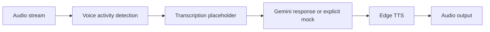

# Architecture

Developer-focused real-time voice assistant demo using LiveKit, Silero VAD, Edge TTS, Gemini, and explicit mock/dependency boundaries.

This document is written for reviewers who want to understand how the project is shaped before reading the code. It emphasizes boundaries, dependencies, and degraded paths rather than marketing claims.

## Data Flow

1. Audio stream
2. Voice activity detection
3. Transcription placeholder
4. Gemini response or explicit mock
5. Edge TTS
6. Audio output

## Main Components

- **VAD**: Uses Silero when available and labels fallback behavior through logs.
- **LLM boundary**: Requires explicit mock mode or valid Gemini dependency/configuration.
- **TTS**: Uses Edge TTS and logs graceful fallback paths.
- **Agent coordinator**: Connects speech events, tools, LLM responses, and output callbacks.

## External Dependencies

- Python 3.11+
- Optional LiveKit
- Optional Silero/Torch
- Optional Gemini API key
- Edge TTS network access

The project is intentionally explicit about optional services. Mock, fallback, and degraded paths are labeled in result metadata so a demo cannot be mistaken for a successful production integration.

## Failure And Degraded Modes

- External-service failures are captured as warnings, status fields, or source metadata where the domain model supports it.
- Mock/demo behavior is opt-in or explicitly labeled.
- Generated outputs are treated as review candidates, not authoritative decisions.
- CLI output remains user-facing; library internals use logging or structured metadata.

## What To Review In Code

- Gemini mock mode is explicit via create_mock()/mock=True.
- Library errors use logging instead of print-based hidden failures.
- Docs identify transcription as a demo placeholder.

## Current Limits

- This is not a drop-in production call-center assistant.
- Transcription is a deterministic placeholder unless replaced.
- Real-time performance depends on network and audio stack setup.
